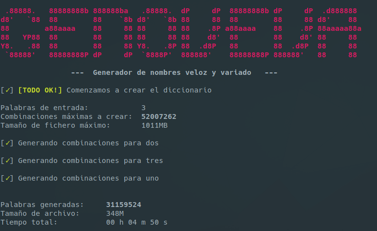

# GENOVEVA

"Generador de nombres veloz y variado"

Desde un listado de palabras, genera **17335754 combinaciones por cada palabra**, mezclando minúsculas, capitalizada, mayúsculas, escritura L33T (completa e individual por cada vocal y "s"), reverso, números de 1 a 4 cifras, fechas en formato mmddyyyy de 1950 a 2020, formato de fecha mmddyy, símbolos al final, símbolos entre nombre y fecha...

Aquí se puede consultar todas las combinaciones para el ejemplo 'abecedarios': 
[ejemplo.txt](ejemplo.txt)


## Uso:

```
Uso:
./genoveva.sh -i inputFile -o outputFile [-vs]
./genoveva.sh -p "uno dos tres"  -o outputFile [-vs]

-i: archivo de entrada que contienen las palabras base
-p: listado de palabras entrecomilladas y separadas por espacios
-o: archivo de salida para el diccionario
-s: Separa la salida en un archivo por cada palabra de entrada
    (un archivo de diccionario completo por cada nombre) 
-v: modo verbose. Muestra las combinaciones creadas
```

<p align="center">
 
</p>


### Versiones

v1.3
- Añadida función para separar la salida en un archivo por cada nombre de entrada.

v1.2
- Arreglado problema con los caracteres (solo se generaba para el primero).

v1.1
- Ahora es posible pasar como entrada palabras en las opciones del comando (-p).
- Comprobaciones en los parámetros para evitar errores.
- Ajustes visuales.

v1.0
- Versión base funcional.


## Extras

[Aquí tenéis disponible un listado que he recopilado de nombres propios en español](nombresEspañol.txt)

Yo me lo pensaría antes de pasarlo completo por GENOVEVA, ya que el archivo de salida tendría **355G** (18687942812 entradas) :)
